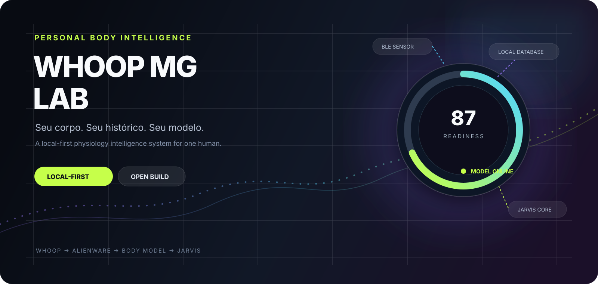
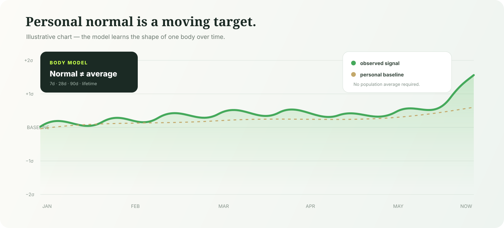
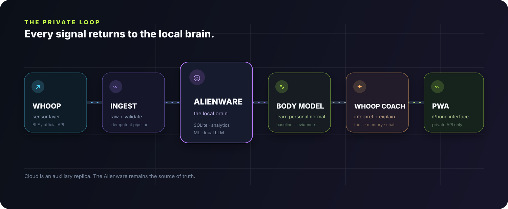
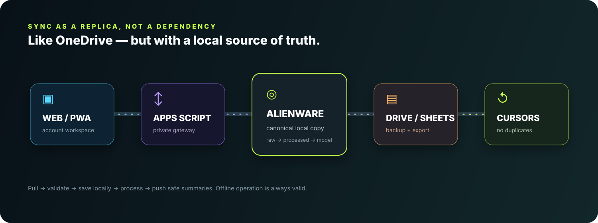

<div align="center">



# WHOOP MG Lab

### Personal body intelligence, built local-first.

WHOOP is the sensor. The Alienware is the brain. The local database is the memory. Jarvis is the layer that learns what is normal **for one human**.

<p>
  <a href="https://silvathiagoferreira.github.io/whoop-mg-platform/"><strong>Open the live PWA</strong></a> ·
  <a href="docs/ARCHITECTURE.md">Architecture</a> ·
  <a href="docs/ROADMAP.md">Roadmap</a> ·
  <a href="docs/LOCAL_SETUP.md">Local setup</a>
</p>

<p>
  
  
  
  
</p>

</div>

> A private, modular physiology platform inspired by the idea of a personal Jarvis. It is an independent analytics project and is not affiliated with WHOOP.

## The idea

Most health dashboards answer: **“How do you compare with everyone else?”**

WHOOP MG Lab is being built to answer a more useful question:

> **“Is this normal for you?”**

The system keeps the sensitive history on the Alienware, builds personal baselines, measures changes against the owner’s own past, and lets a local intelligence layer explain the evidence instead of inventing certainty.



<p align="center"><sub>Illustrative visualization only. No personal physiological data is stored in this repository.</sub></p>

## How it fits together



| Layer | Responsibility | Current state |
| --- | --- | --- |
| WHOOP | Body sensor and source connector | BLE discovery is read-only; official API connector prepared |
| Local Agent | Capture, validate, ingest and synchronize | **Working P0** |
| SQLite + RAW | Canonical local memory with provenance | **Working P0** |
| Analytics | Personal baselines and quality checks | **Working P0** |
| Body Model | Individual normal, trends, anomalies and evidence | Foundation documented; expanding |
| Jarvis Core | Tools, memory, interpretation and chat | Architecture defined; implementation next |
| PWA | Mobile-first interface for iPhone and desktop | Live on GitHub Pages with demo-safe shell |
| Google | Auxiliary backup and account workspace | Browser has no direct Drive/Sheets access |

## The data loop

The cloud is a replica and backup layer — never the physiological brain.



The intended synchronization contract is:

```text
WHOOP / API / manual event
          ↓
Alienware Local Agent
          ↓
RAW preserved → validate → normalize → deduplicate
          ↓
SQLite local source of truth
          ↓
Body Model / analytics / predictions / memory
          ↓
safe summaries and backups → Google Drive / Sheets
          ↓
private API → PWA on iPhone
```

If Google, GitHub or the internet disappears, the local database and processing pipeline remain the primary system.

## What is real today

This repository deliberately distinguishes shipped behavior from the long-term vision.

### Shipped and tested

- React + TypeScript + Vite PWA with a dark, physiology-oriented interface.
- GitHub Pages deployment workflow with lint, typecheck, tests and production build gates.
- Google account-first workspace flow without direct browser access to Drive or Sheets.
- Local Agent with `doctor`, `scan`, `devices`, `inspect`, `ingest`, `baseline`, `sync` and OAuth URL commands.
- SQLite schema for imports, raw payloads, observations, quality, cursors, baselines, memory, events and predictions.
- Idempotent JSON ingestion that preserves original payloads and rejects unsafe duplication.
- Read-only BLE discovery; no invented UUIDs, no firmware writes, no calibration changes.
- WHOOP API v2 connector foundation with pagination, refresh-token handling and provenance fields.
- Windows scripts and documentation for local operation.

### Deliberately not claimed yet

- A WHOOP MG device has not been confirmed in the local BLE scan.
- Historical BLE offload is blocked until the real device and protocol are evidenced.
- Official WHOOP API credentials are still required for live API ingestion.
- Jarvis local-LLM chat, forecasting and advanced anomaly detection are the next layers.
- No physiological values are fabricated to make the dashboard look “complete”.

See the evidence log in [`docs/STATUS.md`](docs/STATUS.md) and the live plan in [`docs/ROADMAP.md`](docs/ROADMAP.md).

## Run it locally

### Web interface

```powershell
npm install
npm run dev
```

Open `http://localhost:5173/whoop-mg-platform/`.

### Local Agent

```powershell
python apps/local-agent/whoop-local.py doctor
python apps/local-agent/whoop-local.py scan --timeout 12
python apps/local-agent/whoop-local.py ingest tests/fixtures/whoop_api_sample.json --source whoop_api_recovery
python apps/local-agent/whoop-local.py baseline hrv --window 28
```

On Windows, the intended entry point is:

```powershell
.\start.ps1
```

The complete setup, environment audit and service notes are in [`docs/LOCAL_SETUP.md`](docs/LOCAL_SETUP.md) and [`docs/ENVIRONMENT_AUDIT.md`](docs/ENVIRONMENT_AUDIT.md).

## Quality gates

```text
lint       → source hygiene
typecheck  → TypeScript contracts
test       → UI and data behavior
build      → Pages artifact
doctor     → host capabilities and local services
```

Every change that reaches `main` must pass the Pages workflow. The repository intentionally keeps health data, SQLite files, exports, tokens and credentials out of Git.

## Security model

- Pages is an interface, not the brain.
- Drive and Sheets are not exposed as user-accessible data stores.
- The browser receives authorized application responses, not raw storage handles.
- Secrets and OAuth tokens stay out of the frontend bundle and repository.
- RAW data is preserved locally for auditability; it is not silently overwritten.
- The Jarvis tool surface is designed around explicit permissions, schemas and logs.
- Remote access will use a private network layer such as Tailscale or an equivalent VPN, not an exposed Alienware port.

Read [`docs/SECURITY.md`](docs/SECURITY.md), [`docs/PRIVACY.md`](docs/PRIVACY.md) and [`docs/DATA_ISOLATION.md`](docs/DATA_ISOLATION.md) before enabling remote access or real data sync.

## Documentation map

<details>
<summary><strong>Core architecture</strong></summary>

- [`ARCHITECTURE.md`](docs/ARCHITECTURE.md) — system boundaries and data flow.
- [`DATA_ARCHITECTURE.md`](docs/DATA_ARCHITECTURE.md) — RAW → validated → normalized → processed.
- [`BODY_MODEL.md`](docs/BODY_MODEL.md) — personal baselines and evidence.
- [`JARVIS_ARCHITECTURE.md`](docs/JARVIS_ARCHITECTURE.md) — tools, context and orchestration.
- [`MEMORY_ARCHITECTURE.md`](docs/MEMORY_ARCHITECTURE.md) — longitudinal memory design.
</details>

<details>
<summary><strong>Integrations</strong></summary>

- [`WHOOP_API.md`](docs/WHOOP_API.md) — official API connector boundary.
- [`BLE_RESEARCH.md`](docs/BLE_RESEARCH.md) — confirmed and unconfirmed protocol evidence.
- [`GOOGLE_SYNC.md`](docs/GOOGLE_SYNC.md) — local-first sync model.
- [`REMOTE_ACCESS.md`](docs/REMOTE_ACCESS.md) — private network access plan.
- [`MOBILE_PWA.md`](docs/MOBILE_PWA.md) — iPhone interface constraints.
</details>

<details>
<summary><strong>Operations</strong></summary>

- [`ENVIRONMENT_AUDIT.md`](docs/ENVIRONMENT_AUDIT.md) — measured Alienware capabilities.
- [`LOCAL_SETUP.md`](docs/LOCAL_SETUP.md) — Windows setup.
- [`WINDOWS_SERVICE.md`](docs/WINDOWS_SERVICE.md) — startup and background agent plan.
- [`TESTING.md`](docs/TESTING.md) — validation strategy.
- [`ROADMAP.md`](docs/ROADMAP.md) — DONE / IN PROGRESS / BLOCKED / NEXT.
</details>

## Project principles

```text
Local first              Sensitive data stays close to the owner.
Evidence before claims   Correlation is not automatically causation.
Personal baselines       Compare Thiago with Thiago before population averages.
Raw is immutable         Processing must be reproducible and auditable.
Offline is valid         Cloud services improve convenience, not correctness.
Modular sensors          WHOOP is the first source, not the last.
Safe by default          No invented protocol, no exposed secrets, no unsafe writes.
```

## Roadmap at a glance

```text
P0  Local foundation       ████████████████░░░░  in progress
P1  Personal intelligence  ██████░░░░░░░░░░░░░░  next
P2  Jarvis interaction     ██░░░░░░░░░░░░░░░░░░  planned
P3  Context + voice        ░░░░░░░░░░░░░░░░░░░░  future
```

The detailed roadmap is intentionally honest about blockers and evidence thresholds.

## License and attribution

This project is personal research software. The name WHOOP is used only to identify the compatible sensor ecosystem; this repository is not affiliated with, sponsored by or endorsed by WHOOP, Inc. Third-party code remains under its own license.

<div align="center">

**Build the model. Keep the memory. Learn the pattern.**

</div>
